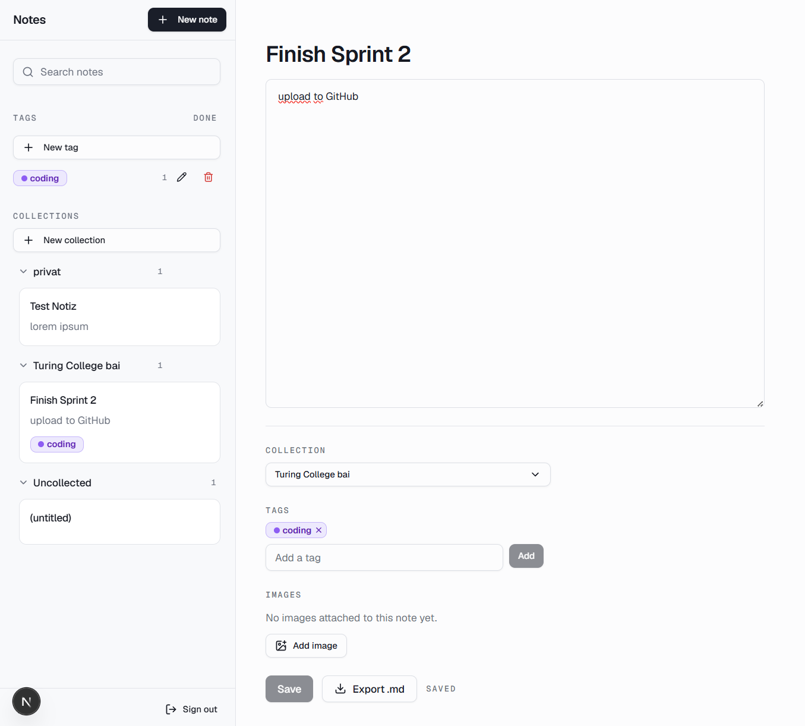

# Notes

A private, per-user notes workspace. Sign in, write notes, group them into collections, colour-code
them with tags, and search the full text of everything you have written. Every note belongs to the
account that created it and is invisible to every other account — enforced by the database, not by
the app.

Built with Next.js (App Router), TypeScript, Tailwind CSS and Supabase.



## What it does

- **Write** — a title and a plain-text body, saved by an explicit Save button, with an **Export .md**
  button that downloads the note as a Markdown file.
- **Organise** — notes belong to a collection (or none), carry any number of colour-coded tags, and
  can be pinned to the top, archived out of the way, or dragged between collections. Archived notes
  can be deleted one at a time or all at once with **Clear archive**. The sidebar's
  tag manager creates, renames, recolours (ten colours) and deletes tags; a rename carries everywhere
  the tag appears, and a delete unfiles the tag without touching the notes.
- **Find** — a search box that queries Postgres full-text search, so the database returns only
  matching rows. Recent searches are remembered.
- **Attach** — images upload to a private Supabase Storage bucket and render on the note when it is
  reopened.
- **Share** — a collection can be published as a read-only link that works without signing in. It is
  the only anonymous read path in the app, and it is token-gated.
- **Sign in** — email and password, Google, or GitHub. Self-service sign-up with email confirmation,
  and a password-reset flow by email.

## Run it locally

You need Node.js and a Supabase project.

```bash
npm install
npm run dev          # http://localhost:3000
```

### Environment variables

Create **`.env.local`** in the repo root before starting the server — the app throws on boot without
it:

```env
NEXT_PUBLIC_SUPABASE_URL=https://<your-project-ref>.supabase.co
NEXT_PUBLIC_SUPABASE_PUBLISHABLE_KEY=sb_publishable_...
```

Both values live in your Supabase dashboard under **Project Settings → API Keys**. Use the
**publishable** key, whose value starts with `sb_publishable_`; the legacy `anon` JWT works too.

Nothing else belongs in this file. If a feature seems to need the service-role or secret key, an RLS
policy is wrong — fix the policy. `.env.local` is git-ignored and must stay that way.

### Supabase setup

1. **Schema.** Apply [`docs/schema.sql`](docs/schema.sql) — it is the current-state reference for
   every table, index, policy, trigger and function, written to run top to bottom in the dashboard
   SQL editor. Incremental changes live in [`supabase/migrations/`](supabase/migrations) and go out
   with `npx supabase db push --linked`.

   One migration sorts out of order: `20260814085000_add_rls_auto_enable.sql` is dated before
   `20260814085033_harden_rls_policies.sql`, which references the function it creates. On a
   project that already has the later migration but not this one, `db push` refuses; run
   `npx supabase db push --linked --include-all` once, then the plain command from then on.
2. **Redirect URLs.** Authentication → URL Configuration → add `http://localhost:3000/**`. Every
   OAuth return and emailed auth link comes back to this origin; without the entry they land on the
   Site URL instead and the flow dies quietly.
3. **Email confirmation.** Authentication → Sign In / Providers → Email → turn **Confirm email** on,
   so registration sends the confirmation mail the sign-up flow expects.
4. **Providers.** Enable Google and GitHub under Sign In / Providers if you want the social buttons,
   pointing each OAuth app's callback at Supabase's own `/auth/v1/callback`.
5. **Test accounts.** Create them by hand in Authentication → Users, or register through
   `/auth/sign-up`.

### Verifying it works

```
sign in                     → land on /notes
create a note, reload       → the note is still there
sign out, open /notes       → redirected to sign-in
sign in as a second account → none of the first account's notes are visible
```

## How it is put together

| Path | What lives there |
| --- | --- |
| `app/notes/` | The workspace: sidebar layout, note detail page, and every Server Action |
| `lib/db/` | **All** database access. No component builds a Supabase client or holds a query |
| `lib/supabase/` | The browser, server and proxy clients |
| `docs/schema.sql` | Current-state schema: tables, RLS policies, functions, triggers |
| `supabase/migrations/` | Incremental schema changes, applied through the Supabase CLI |
| `CLAUDE.md` | The rules this codebase is built to, including the authentication rules |

Two things worth knowing before reading the code:

**Row Level Security does the scoping.** Every table has owner-scoped policies, so no query in
`lib/db/` filters by user — the database refuses other people's rows even if the application forgets
to ask correctly. A consequence: an unauthorised read returns `[]` with `error: null`, which is why
every page gate exists and every helper checks `error` explicitly.

**Sessions are verified by the Auth server.** `requireUser()` in `lib/db/auth.ts` calls
`supabase.auth.getUser()`, which asks Supabase rather than inspecting a token the browser sent. Every
signed-in-only page and every Server Action goes through it.

## Optional tasks delivered

Each was built on its own feature branch and merged through a pull request:

| Task | Difficulty | PR |
| --- | --- | --- |
| Server-side search, and tags with a tag filter | Medium | [#2](https://github.com/flowrider1990/notes-app-w-collections-and-search/pull/2) |
| Loading states — skeletons instead of blank flashes | Easy | [#3](https://github.com/flowrider1990/notes-app-w-collections-and-search/pull/3) |
| Minimalist design pass | Easy | [#4](https://github.com/flowrider1990/notes-app-w-collections-and-search/pull/4) |
| Export a note to Markdown | Medium | [#5](https://github.com/flowrider1990/notes-app-w-collections-and-search/pull/5) |
| Image uploads to Supabase Storage | **Hard** | [#6](https://github.com/flowrider1990/notes-app-w-collections-and-search/pull/6) |
| Password-reset email flow, self-service sign-up, and GitHub social login | Medium / **Hard** | [#8](https://github.com/flowrider1990/notes-app-w-collections-and-search/pull/8) |

Design notes, trade-offs and the reasoning behind the persistence choice are in
[`REFLECTION.md`](REFLECTION.md) and [`docs/decisions.md`](docs/decisions.md).
